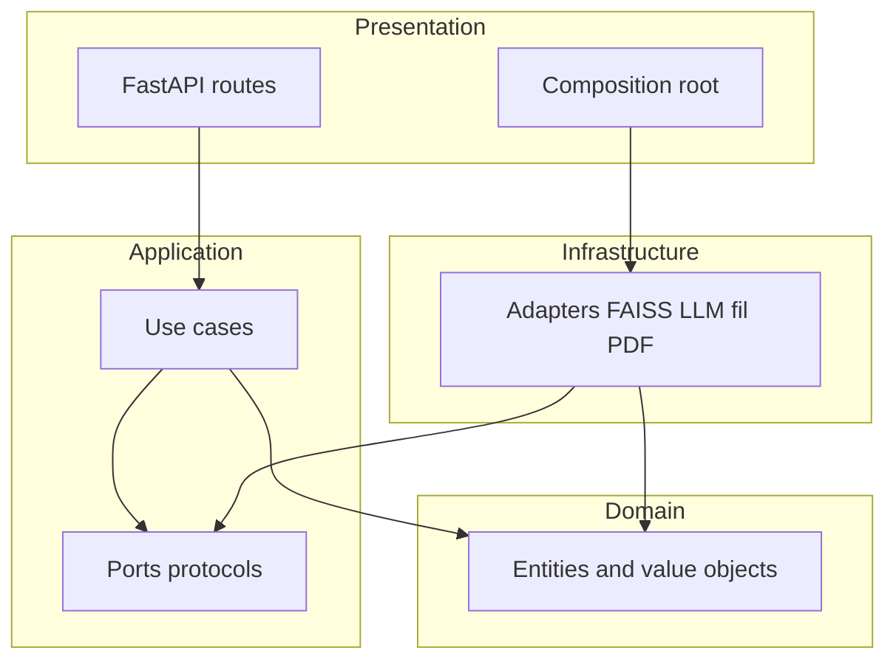
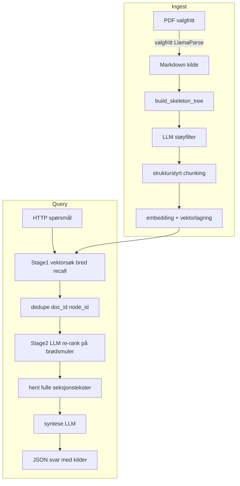

# Plan: Generisk Proxy-Pointer RAG-mal (FastAPI)

## Kontekst

[Artikkelen](https://towardsdatascience.com/proxy-pointer-rag-structure-meets-scale-100-accuracy-with-smarter-retrieval/) beskriver **Proxy-Pointer RAG**: struktur (Markdown-overskrifter) inn i vektorindeksen, brødsmulesti i embeddings, strukturstyrt chunking, støyfiltrering, og **peker-basert kontekst** (hentede noder lastes som hele seksjoner til syntese-LLM). Raffinert pipeline: **FAISS bred recall** → deduplisering til unike noder → **LLM re-rangering på struktur** → `k_final` seksjoner → svar.

Valgt leveranseform fra deg: **FastAPI-HTTP-tjeneste** (indeksering + spør/chat), ikke bare CLI.

Repo i dag: kun [README.md](d:\Repositories\rag-template\README.md) og LICENSE — **greenfield**.

## Modulær monolitt og Clean Architecture

**Modulær monolitt:** én prosess og én deploybar enhet (FastAPI), men kode organisert i **avgrensede moduler** (`indexing`, `query`, `benchmarking`) med tydelige pakkegrenser og minimering av tverrmodul-import. Målet er å kunne løfte ut et modul til eget bibliotek eller tjeneste senere uten total omskriving.

**Clean Architecture (lag og avhengighetsretning):**

- **Domene** (`rag_template_core/domain/`): entiteter og verdiobjekter (f.eks. `DocumentNode`, `Chunk`, `BreadcrumbPath`), domenehendelser/regler uten FastAPI, httpx, FAISS eller filstier. Ingen import fra ytre lag.
- **Applikasjon** (`rag_template_core/application/`): **brukstilfeller** (orkestrering: «indekser markdown», «kjør spørsmål»), **porter** (`typing.Protocol` / ABC: `LlmPort`, `EmbedderPort`, `VectorStorePort`, `SectionSourcePort`, `PdfExtractorPort`). Applikasjon importerer kun domene (+ standardbibliotek).
- **Infrastruktur** (`rag_template_core/infrastructure/`): konkrete adaptere (FAISS, Anthropic, Ollama, LlamaParse, filbasert indeksmetadata). Implementerer porter definert i applikasjon; får injisert config via konstruktør/fabrikk — **ikke** globale `os.environ` lest inne i domene.
- **Presentasjon** ([`app/`](d:\Repositories\rag-template\app)): FastAPI-ruter, request/response-skjemaer (Pydantic API-modeller), validering av HTTP. Tynne: kaller én applikasjons-tjeneste per endepunkt og mapper feil til HTTP-koder.
- **Composition root** ([`app/container.py`](d:\Repositories\rag-template\app\container.py) eller tilsvarende): eneste sted som **kobler** porter til konkrete adaptere ut fra `Settings` (Pydantic-settings). Unngår at ruter instansierer FAISS direkte.

**Regel:** avhengigheter peker **innover** (presentasjon → applikasjon → domene; infrastruktur → applikasjon/domene). Domene kjenner ikke til «vektorbase» eller «Claude».

**Verktøy (valgfritt etter MVP):** [`import-linter`](https://github.com/seddonym/import-linter) eller lignende for å **håndheve** lag-forbud i CI (kontrakter: `domain` kan ikke importere `application` osv.).

## Målarkitektur

## Katalogforslag (lag + moduler, snake_case)

| Lag | Sti (forslag) |
|-----|----------------|
| Presentasjon | [`app/main.py`](d:\Repositories\rag-template\app\main.py), [`app/api/`](d:\Repositories\rag-template\app\api\) (ruter), [`app/container.py`](d:\Repositories\rag-template\app\container.py) (DI / wiring) |
| Konfig (delt) | [`rag_template_core/config/settings.py`](d:\Repositories\rag-template\rag_template_core\config\settings.py) — lest kun av composition root og adapter-fabrikker |
| Domene | [`rag_template_core/domain/`](d:\Repositories\rag-template\rag_template_core\domain\) — noder, chunks, indeks-identiteter, domene-feiltyper |
| Applikasjon | [`rag_template_core/application/ports/`](d:\Repositories\rag-template\rag_template_core\application\ports\) (protokoller); [`.../indexing/`](d:\Repositories\rag-template\rag_template_core\application\indexing\) og [`.../query/`](d:\Repositories\rag-template\rag_template_core\application\query\) (use cases som orkestrerer Proxy-Pointer-steg) |
| Infrastruktur | [`rag_template_core/infrastructure/`](d:\Repositories\rag-template\rag_template_core\infrastructure\) — `persistence/` (FAISS + metadatafil), `llm/` (`registry.py`, `providers/` med én pakke/modul per leverandør som implementerer `LlmPort`), `embeddings/` (samme mønster: `EmbedderPort` + `providers/`), `extraction/` (LlamaParse) |
| Benchmark (modul) | [`rag_template_core/application/benchmarking/`](d:\Repositories\rag-template\rag_template_core\application\benchmarking\) (brukstilfelle «kjør matrise»); CLI/tynn wrapper under [`scripts/`](d:\Repositories\rag-template\scripts\) eller `python -m`; fiksturer i [`tests/benchmarks/`](d:\Repositories\rag-template\tests\benchmarks\) |

**Merk:** Applikasjonen kjenner kun **porter** (`LlmPort`, `EmbedderPort`, …). **Leverandørvalg** er rent infrastruktur: ny API-leverandør = ny modul under `providers/` + registrering i `registry.py` (eller dekorator/entry point-mønster), uten endring i use cases så lenge port-kontrakten holder.

## API-design (FastAPI)

- **POST `/v1/index/markdown`** — last opp eller URL til `.md`, `doc_id`, bygg skjelett → filter → chunks → indeks (synkront eller jobb-ID hvis store filer; start enkelt med synkront + tydelig `max_upload_mb`).
- **POST `/v1/index/pdf`** (valgfritt) — krever `LLAMA_CLOUD_API_KEY` / tilsvarende; PDF → MD → samme pipeline.
- **POST `/v1/query`** — `question`, parametre som `k_recall`, `k_candidates`, `k_final` (speiler artikkelen: f.eks. 200 → 50 → 5).
- **GET `/v1/health`** — sjekk API-nøkler og at indeks finnes.

Svarobjekt bør inkludere **brødsmulesti per kilde**, `node_id`, og kort **sitat/offset** der det er mulig — i tråd med artikkelens «glass-box»-sporbarhet.

## Konfigurasjon og feature flags (env)

Minimum i `.env.example` (ingen hemmeligheter i repo):

**LLM (utvidbar, én port):**

- **Rolle-basert valg (anbefalt):** `LLM_ROUTING_PROVIDER` og `LLM_SYNTHESIS_PROVIDER` som hver er en **streng provider-id** registrert i `llm_registry` (samme id for begge hvis du vil forenkle). Alternativt én `LLM_PROVIDER` som default for begge roller der det ikke settes eksplisitt.
- **Kontrakt `LlmPort`:** bl.a. chat-komplettering og **strukturert/JSON-lignende svar** for støyfilter og re-rank (felles semantikk uansett leverandør); valgfritt felter for `temperature`, `max_tokens`, `timeout` per kall.
- **Første adaptere i malen (MVP):** `anthropic`, `ollama`, `openai_compatible` (OpenAI-kompatibel HTTP/SDK med `base_url` + `api_key` — dekker f.eks. OpenAI, Azure OpenAI med riktig base path, Groq, Mistral API, vLLM/TGI, mange hosted «OpenAI-likes»).
- **Videre leverandører (samme port, egne moduler + ev. valgfri `pyproject` extra):** `google_genai` (Gemini), `mistral_official`, `cohere`, `amazon_bedrock`, `vertex`, `azure_ai_inference`, osv. — legges til etter hvert uten å endre domene/applikasjons-API.
- **Bro for «alle modeller» med minimalt vedlikehold:** valgfri adapter `litellm` (eller tynn klient mot OpenRouter) som tar `model=` i formatet leverandøren forventer (`provider/model`) og implementerer `LlmPort`; bak feature-flag / egen extra `pip install .[litellm]` så kjernen ikke drar inn tung graf avhengighet som standard.
- **Nøkler og endepunkter:** kun i **leverandørspesifikk** config (prefiks i `.env.example`, f.eks. `ANTHROPIC_*`, `OLLAMA_*`, `OPENAI_*`, `AZURE_OPENAI_*`, `GOOGLE_*`, …) lest av composition root / fabrikk for den aktuelle adapteren — ikke spredt i domene.

**Embeddings (egen port, samme utvidelsesmønster):**

- `EMBEDDING_PROVIDER` som registrert id (`ollama`, `openai_compatible`, `google_genai`, `cohere`, …) — samme **registry/fabrikk**-idé som for `LlmPort`.
- `EMBEDDING_DIMENSION` må matche valgt modell (FAISS bygges med denne dimensjonen). Flere tekst-LLM-leverandører tilbyr ikke embeddings; da velges egen embedding-leverandør eksplisitt.

**Øvrig:**

- `ENABLE_LLAMAPARSE`, `LLAMA_CLOUD_API_KEY` — PDF-sti av/på
- `ENABLE_LLM_NOISE_FILTER` — fallback: enkel heuristikk / statisk liste når av
- `ENABLE_LLM_RERANKER` — fallback: ren embedding-rangering når av (ny funksjonalitet bak flagg, i tråd med dine regler)
- `ENABLE_BENCHMARK_JUDGE` — valgfri LLM-as-judge ved modellmatrise-kjøringer (av som standard)
- FAISS-sti: `INDEX_DIR` eller `FAISS_INDEX_PATH`

**Validering ved oppstart:** `health` sjekker at valgt `LLM_*_PROVIDER` / `EMBEDDING_PROVIDER` finnes i registry, at påkrevd nøkkel/base_url for den adapteren er satt, og evt. ping til Ollama/HTTP-endepunkt — med tydelig feilmelding per leverandør-id.

## Implementasjonsdetaljer fra artikkelen (kjerne)

1. **Skjelett-tre:** Pure Python fra Markdown `#`…`######` → hierarkisk JSON (noder med `node_id`, tittel, nivå, rekkefølge).
2. **Strukturstyrt chunking:** Del kun *innenfor* seksjonsgrenser; ingen chunk på tvers av overskriftsnoder.
3. **Brødsmuleinjeksjon:** Tekst som embeddes = `path > to > section` + chunk-innhold.
4. **Støyfilter:** Når flagg på — send komprimert tre til «lite»-modell; når av — enkel stopplist/heuristikk så malen fungerer uten ekstra LLM-kost ved indeksering.
5. **Stage 1:** Top-N etter cosine (FAISS), dedupe på `(doc_id, node_id)`, kutt til `k_candidates` unike noder.
6. **Stage 2:** Send kandidatenes brødsmulestier til LLM; få permutasjon / topp-`k_final` node-ID-er.
7. **Pointer-kontekst:** For hver valgt node, hent **full seksjonstekst** (ikke bare chunk-fragment) fra lagret dokument/metadata og send til syntese-LLM.
8. **Graceful degradasjon:** Dokument uten overskrifter → ett «rot»-node eller flat chunking (artikkelen nevner dette eksplisitt).

## Utvidbare LLM-leverandører (implementasjonsnotat)

- **Én port, mange adaptere:** Hver leverandør implementerer `LlmPort` (og ev. egen `LlmProviderFactory` som får `Settings`-delsett). Composition root spør `build_llm_client(role=...)` som slår opp i **registry** etter streng id.
- **JSON / strukturert output:** Støyfilter og re-rank forventer maskinlesbar struktur (node-id-er eller rangering). Hver adapter er ansvarlig for å kartlegge dette til leverandørens muligheter: f.eks. native JSON mode, `response_format`, `tool_use` / function calling, eller robust «JSON i tekstblokk» + parse — uten at use cases vet hvilket API som brukes.
- **OpenAI-kompatibel adapter:** Mange leverandører eksponerer OpenAI-lignende `/v1/chat/completions`; én godt testet `openai_compatible`-adapter dekker et stort antall hosted og lokale endepunkter via `base_url` + modellstreng.
- **Nye leverandører:** Sjekkliste for bidrag: (1) modul under `infrastructure/llm/providers/<id>/`, (2) registrer id i `registry.py`, (3) dokumenter env-variabler i `.env.example`, (4) valgfri `pyproject`-extra, (5) enhetstest med mocket HTTP/SDK.
- **Eksempel-oppsett:** Lokal alt-i-Ollama: `LLM_ROUTING_PROVIDER=ollama`, `LLM_SYNTHESIS_PROVIDER=ollama`, `EMBEDDING_PROVIDER=ollama`. Sky med Anthropic tekst + OpenAI-kompatible embeddings: `anthropic` + `openai_compatible` med egne nøkler.

## Avhengigheter og verktøy

- Python 3.11+, `uv` eller `pip` + `pyproject.toml` med **`extras_require`** per leverandør (f.eks. `.[anthropic]`, `.[google-genai]`, `.[litellm]`) slik at minimal install kun har `httpx` + kjernebibliotek der det holder.
- `fastapi`, `uvicorn`, `pydantic-settings`, `httpx` (felles for HTTP-baserte adaptere)
- `faiss-cpu` (evt. `faiss-gpu` som valgfri ekstra)
- Leverandør-SDKer kun som valgfrie avhengigheter når id er aktiv (Anthropic SDK, OpenAI SDK, `google-genai`, osv.)
- Valgfritt: `llama-cloud-services` / offisiell LlamaParse-klient for PDF

## Modellsammenligning og benchmark-tester

Målet er å **kjøre identisk RAG-pipeline** (samme indeks, samme `k_*`) med ulike modellprofiler og samle sammenlignbare tall — ikke bare «føles bedre».

**Design:**

- **`ModelProfile`** (Pydantic eller dataclass): `llm_routing_provider`, `llm_synthesis_provider` (eller enkelt `llm_provider`), modellstrenger per leverandør, ev. `embedding_provider` + embedding-modell ved sammenligning av indeks (krever gjenindeksering — dokumenteres).
- **Fast invariants (CI):** små Markdown-fiksturer i repo; tester med **mocket** LLM/embedding som verifiserer at riktige adaptere kalles og at JSON fra re-rank/støyfilter parses. Ingen API-kost i standard `pytest`.
- **Sammenligning mot ekte modeller (valgfritt, lokalt/CI-natt):** `pytest -m live_models` eller egen CLI `python -m rag_template_core.benchmarks.run_matrix --config benchmarks/model_matrix.yaml`. Matrise definerer liste over profiler × samme `questions.yaml` (spørsmål + valgfritt `expected_node_ids` eller kort `reference_answer` for enkel string-sjekk).
- **Målinger per spørsmål og profil:** veggklokke-latens per trinn (indeks gjenbrukes: kun query-latens), antall tegn/tokens om API eksponerer det, **retrieval-treff** om gull finnes: f.eks. Jaccard/overlap mellom hentede `node_id` og forventet mengde, eller `hit@k_final`.
- **Valgfri LLM-as-judge:** bak `ENABLE_BENCHMARK_JUDGE` — fast modell (f.eks. én Claude-Sonnet-kjøring) som scorer 1–5 på *grunnhet i forhold til utlevert kontekst*; kjører kun når nøkkel finnes. Ikke påkrevd for å sammenligne to Ollama-modeller lokalt.
- **Output:** tidsstemplet `benchmarks/out/*.json` (maskinlesbart) + én aggregert CSV (profil × gjennomsnitt/median) for rask graf i regneark.

**Skille fra FinanceBench:** ingen proprietær datasett-i-repo; kun **bring your own** spørsmålsfiler og valgfri gull-metadata du legger inn selv.

## Kvalitet og sikkerhet

- Validering av filtyper og størrelse; ingen vilkårlig filskriving utenfor `INDEX_DIR`.
- Rate limiting eller enkel API-nøkkel-header (`X-API-Key`) som valgfri beskyttelse for tjenesten i malen.
- Logging uten PII-rålekker; strukturerte logger for retrieval-steg.

## Verifikasjon

- Enhetstester for: tre-parser på kjente MD-eksempler, dedupe-logikk, at «pointer» laster riktig seksjonstekst.
- Integrasjonstest mot FastAPI med `TestClient` og mocket LLM/embedding der det er hensiktsmessig.
- **Modellmatrise:** minst én integrasjonstest som kjører «to mock-profiler» gjennom samme benchmark-runner og assert på identisk retrieval når mock er konfigurert likt; dokumenter hvordan man kjører live-sammenligning lokalt.
- Manuell QA: indekser liten MD-fil, kjør spørsmål, bekreft brødsmuler og svar i JSON.

## Bevisst utenfor scope (første iterasjon)

- Full repro av FinanceBench / 10-K datasett (kan lenkes som eksempel senere).
- Horisontal skalering av indeks (én prosess / én FAISS-fil er nok for mal).

## Neste steg etter godkjenning

Opprett feature-branch fra `main`. Start med **domene + porter + én use case** (f.eks. indeksering) med fake-in-memory adaptere i tester; deretter FAISS/LLM-adaptere og composition root; til slutt FastAPI-ruter som kaller use cases. Minimal kjørbar sti: Markdown → indeks → `/v1/query` med mockbar `LlmPort`/`EmbedderPort`.